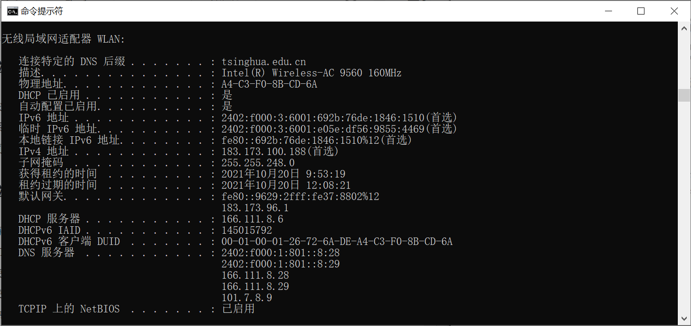
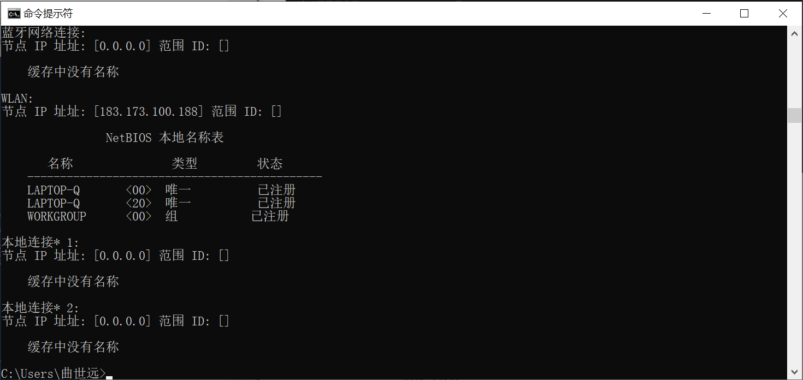
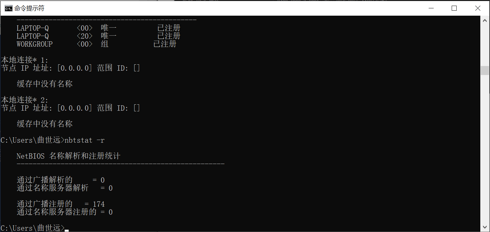
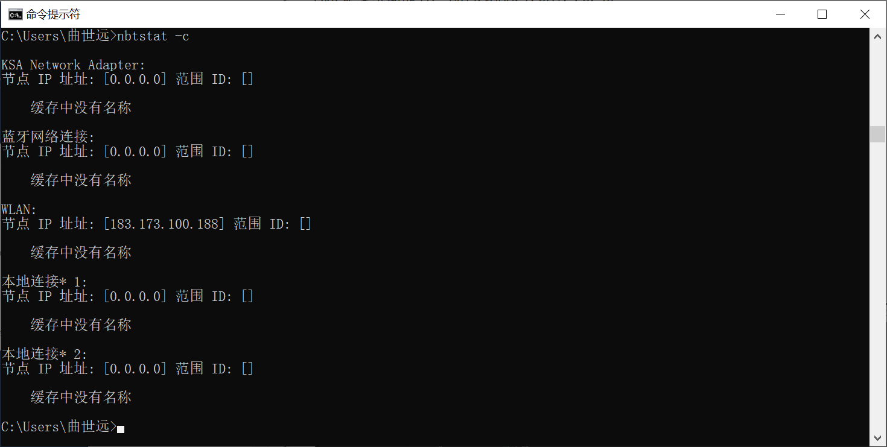
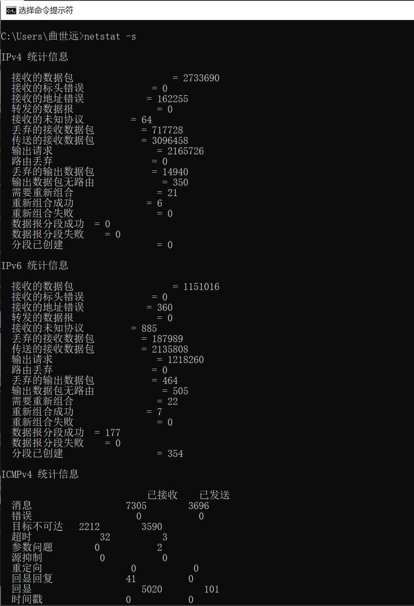
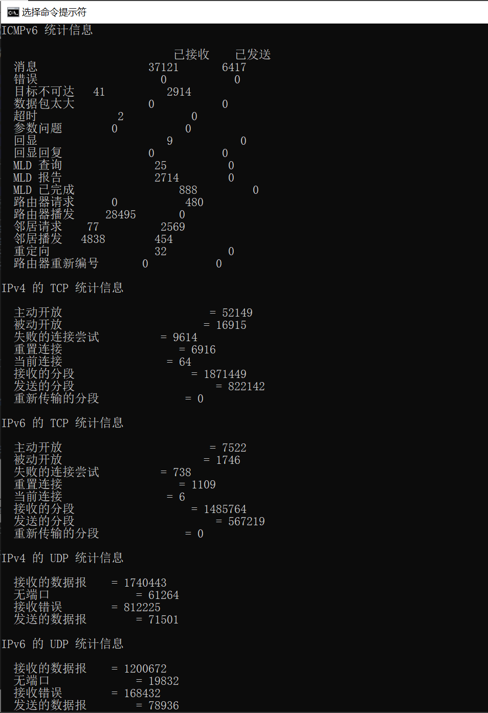
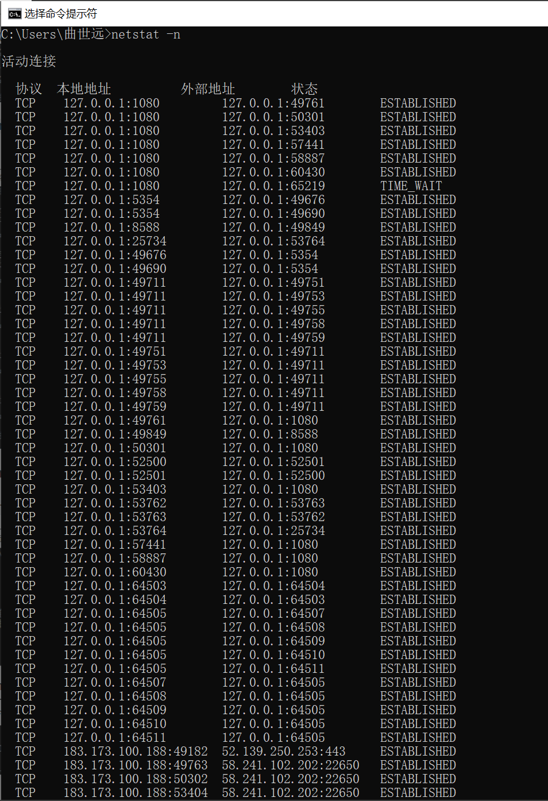
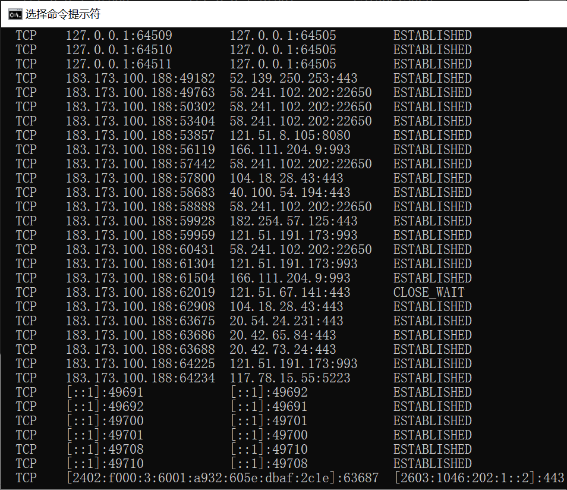

<h2  align = "center" >计算机网络与应用 第一次实验报告 </h2>

<h6 align = "center">自96 曲世远 2019011455</h6>

### 实验目的

​	练习使用网络常用命令，进一步了解网络地址、子网掩码、域名、网关、路由、地址解析、协议和端口等基本概念；通过查看和测试网络状态，发现和解决网络可能存在的问题。

### 实验环境

版本：Windows 10 家庭中文版

版本号：20H2

操作系统内部版本：19042.1288

### 实验内容

##### 1.练习使用ipconfig工具，检测网络配置查看并记录本地微机的IP(V4)地址、子网掩码、DNS服务地址、默认网关地址、网卡物理地址等；

IPV4地址为：183.173.100.188

子网掩码为：255.255.248.0

DNS服务器地址为：2402: f000: 1: 801:  : 8: 28

​								   2402: f000: 1: 801:  : 8: 29

​								   166.111.8.28

​								   166.111.8.29

​								   101.7.8.9

默认网关地址为：fe80: : 9629: 2fff: fe37: 8802%12

​							   183.173.96.1

网卡物理地址为：A4-C3-F0-8B-CD-6A

##### 2.使用nbtsat工具，确定本机和相邻微机的netbios信息；

先使用`nbtstat -n`和`nbtstat -r` 指令得到本机的netbios信息：

再使用`nbtstat -c` 检测本机的相邻微机，由于没有相邻微机，故无法给出相邻微机的信息。

##### 3.使用netstat工具，查看并记录本机传输层协议统计信息和协议端口；

使用`netstat -s`查看以太网传输层协议统计信息：

