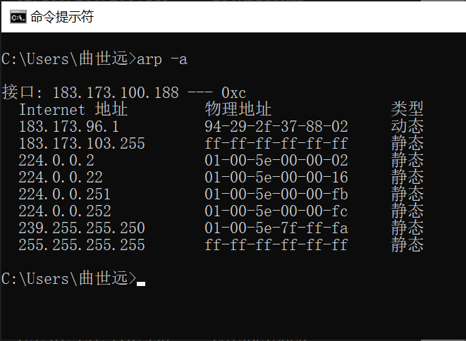

<h2  align = "center" >计算机网络与应用 第一次实验报告 </h2>

<h6 align = "center">自96 曲世远 2019011455</h6>

[TOC]

### 实验目的

​	练习使用网络常用命令，进一步了解网络地址、子网掩码、域名、网关、路由、地址解析、协议和端口等基本概念；通过查看和测试网络状态，发现和解决网络可能存在的问题。

### 实验环境

版本：Windows 10 家庭中文版

版本号：20H2

操作系统内部版本：19042.1288

### 实验内容

##### 1.练习使用ipconfig工具，检测网络配置查看并记录本地微机的IP(V4)地址、子网掩码、DNS服务地址、默认网关地址、网卡物理地址等；

IPV4地址为：183.173.100.188

子网掩码为：255.255.248.0

DNS服务器地址为：2402: f000: 1: 801:  : 8: 28

​								   2402: f000: 1: 801:  : 8: 29

​								   166.111.8.28

​								   166.111.8.29

​								   101.7.8.9

默认网关地址为：fe80: : 9629: 2fff: fe37: 8802%12

​							   183.173.96.1

网卡物理地址为：A4-C3-F0-8B-CD-6A

##### 2.使用nbtsat工具，确定本机和相邻微机的netbios信息；

先使用`nbtstat -n`和`nbtstat -r` 指令得到本机的netbios信息：

再使用`nbtstat -c` 检测本机的相邻微机，检测到相邻微机的netbios信息。

##### 3.使用netstat工具，查看并记录本机传输层协议统计信息和协议端口；

使用`netstat -s`查看以太网传输层协议统计信息：

使用`netstat -n`指令列出活动的协议端口

##### 4.熟悉arp命令的基本用法，了解IP地址和物理地址间映射关系，察看本机、相邻主机或网关的IP地址和物理地址的映射关系；

使用`arp -a`命令，得到IP地址和物理地址之间的映射关系，

默认网关的IP地址与物理地址映射关系为：183.173.96.1 -- 94-29-2f-37-88-02

本机IP地址和物理地址之间的映射关系为：183.173.100.138 -- 0xc

##### 5.练习使用ping命令，测试网络连通性，要求测试本机、邻居微机、默认网关、域名服务器、远程网络地址等；

1. 测试本机：

   

2. 测试邻居微机：

   

3. 测试默认网关：

   

4. 测试域名服务器：

   

5. 测试远程网络地址：

   

##### 6.练习使用 tracert 命令，检测到达目的地址166.111.8.28所经过的路由器的IP地址；

跟踪结果如下图所示：

### 实验思考

##### 1.在Internet上进行网络通信，主机必须包含的基本网络配置有哪些？必须具有哪些地址？

在Internet上进行网络通信，主机必须包含连接至以太网或是无线局域网的环境，并且具有实现网络通信协议的硬件及软件配置；必须具有IP地址、子网掩码、默认网关、DNS服务器地址。

##### 2.在使用tracert命令时，在路由检测的过程中可能会出现 “*”，是否一定代表路由不可到达？为什么？

不是。‘\*’表示该报文出现了丢包的情况，首先是每次执行命令，路由器会发出三个报文，只有一个报文丢包并不说明路由不可到达；其次是出现的‘\*'只表示本路径的本报文出现了丢包，但并不代表没有其他路径联通至该路由器。

##### 3.分别使用ping -r和tracert检验到166.111.8.28所通过的路径，分析到达该目标地址的相关路由，获得的路由信息有何不同？并画出到达目的地址的路径示意图。

下图为`ping -r 9`指令获取的路由路径图，`ping -r 9`进行了四次尝试试图获取少于9个节点的路由路径信息，且为信息发出与返回的完整路径。

下图为`tracert`指令获得的路由路径，他只记录了发送信息的单程路经，不过包含有每级路由的时延，且为三个不同报文的分别时延。

##### 4.实验中还出现了哪些你认为不该出现的或不能解释的现象，你是如何分析和理解的？

我在使用我女朋友的电脑作为相邻微机并关闭了防火墙后是可以`ping`通的，同时也可以在`nbtstat -c`中查看到该微机的netbios信息，但是我却没有在`arp -a`中找到对于该ip的缓存，同时使用`arp -a [ip]`也显示未找到arp项。

在查阅了相关资料并请助教解释了相关原理后，发现是我的主机和“邻居微机”不在一个子网中，所以arp并不能显示缓存信息，将网关作为邻居即可解决。

