<h2  align = "center" >计算机网络与应用<br>第二次实验报告 </h2>

<h6 align = "center">自96 曲世远 2019011455</h6>


[TOC]


### 实验目的

​	通过实验熟悉常用网络服务的基本原理和基于客户机/服务器的服务模式，掌握各项服务的服务原理，练习常用网络服务的配置方法。

### 实验环境

版本：windows server2003 / windows 7

### 实验内容

##### 1.在windows环境练习下配置DNS服务，理解域名服务的解析原理和层次关系及相关概念。

将用于实验的两台计算机通过网线直接相连后，分别指定客户机与服务器，分别设置各自的IP地址，但需要注意确保两台机器的IP地址处于同一子网中。将客户机的DNS设置为服务器的IP地址。设置如下图所示：[客户机配置完毕]

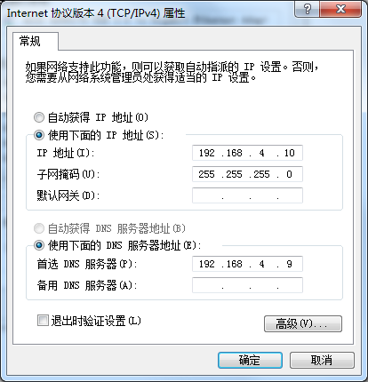

之后进行服务器端的设置。设置好与客户机设置相匹配的IP地址后，可以在DNS服务的配置界面中添加一个新的DNS服务器，之后分别创建正向与反向查找区域，如下图所示：

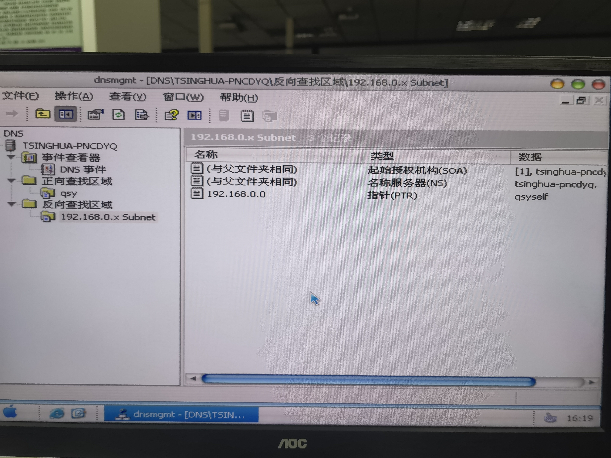

如图所示的正向查找区域配置了域名为name.qsy的记录，指向了192.168.0.10的IP地址，就可以通过该域名访问该IP地址，而反向查找区域主要是用于已知IP地址查找主机名称。[服务器端配置完成]


下面在客户机上通过直接访问域名获取到了域名对应的IP地址：

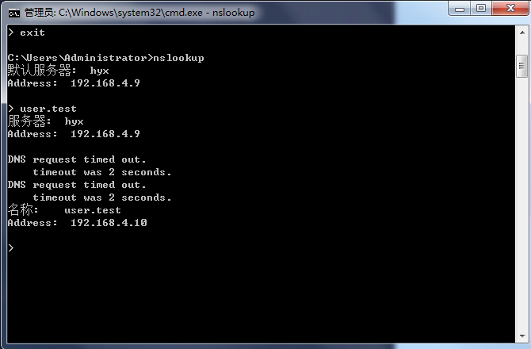

##### 2.在windows环境中用Apache HTTP Server开设WWW服务，安装配置PHP动态网页编辑环境。

依据实验指导书的规则配置Apache，可以在浏览器中通过访问php文件名称访问到网页内容。

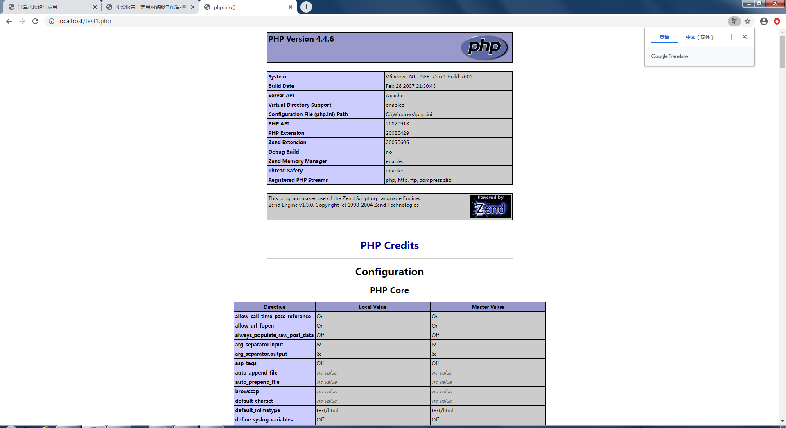

在php文件中，可以将方可访问次数存储至文件中，并且基于访问次数调整显示的内容。同时还可以基于系统时间显示当前日期与时间。同时，该网页还可以基于上一问设置好的DNS域名服务器通过域名访问IP地址访问到该网页。网页实现的效果如下：


##### 3.利用SERV-U实现ftp服务，并针对不同用户、地址或端口进行授权访问；

搭建一个个人FTP服务器，依据实验指导书上的方法与步骤设置一个用户并给予相关的权限并设置用户名密码目录等。

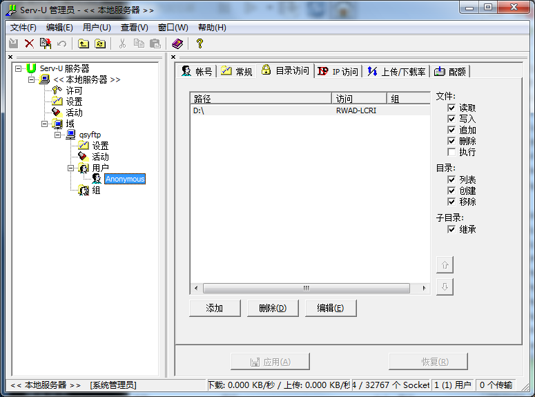

使用该FTP服务器时，使用FlashFXP软件，建立一个绘画实现从可访问的目录中获取/向其上传文件。

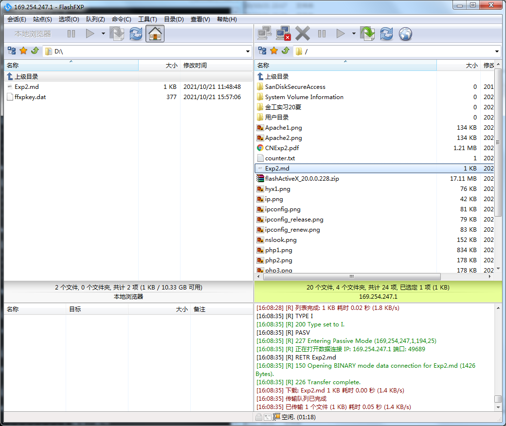

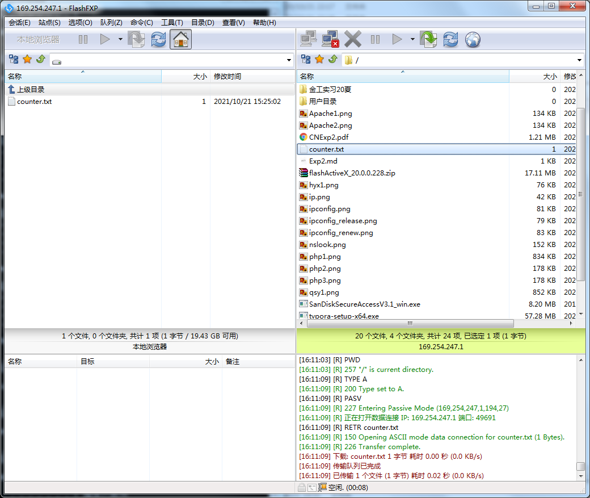


##### 4.掌握DHCP服务器的安装与设置,了解DHCP的含义及工作原理,了解DHCP客户机的设置；

依据实验指导书中的步骤介绍，新建一个DHCP作用域，并为该作用域分配一部分IP地址，也可以设置排除地址和用户保留地址

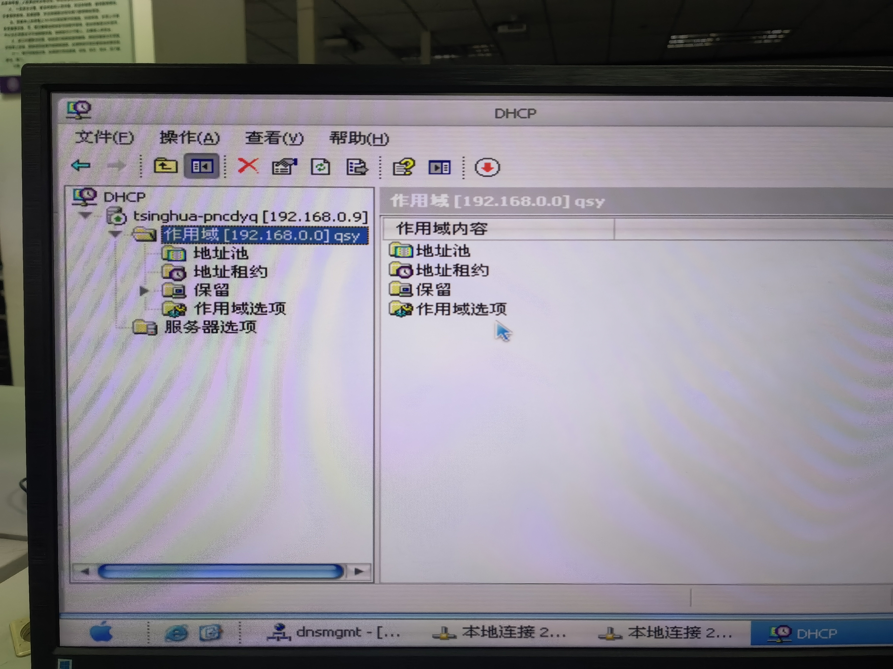


之后可以在客户机上先将IP地址获取方式设置为自动获取IP地址。使用命令行查看IP配置可以检查客户机配置，也可以使用`release`释放当前租约，使用`renew`可以续订更新租约

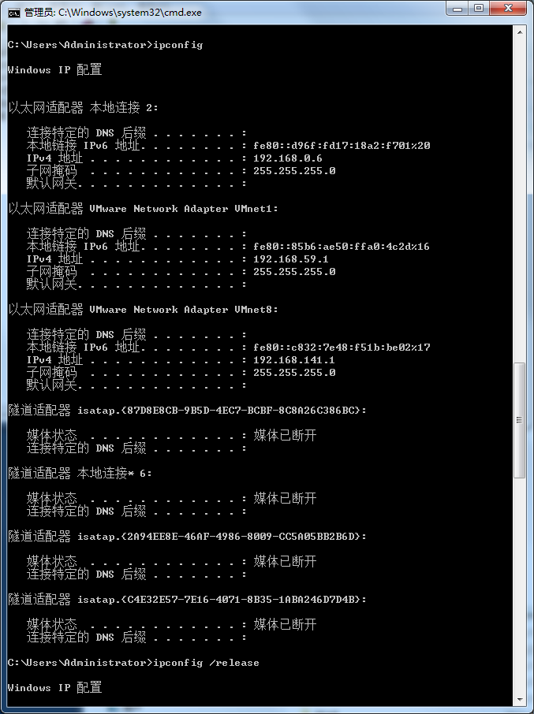

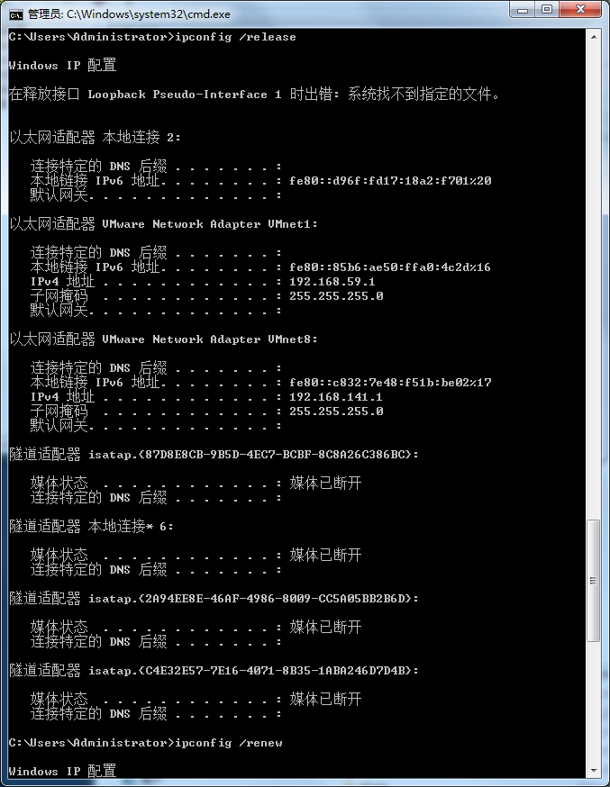

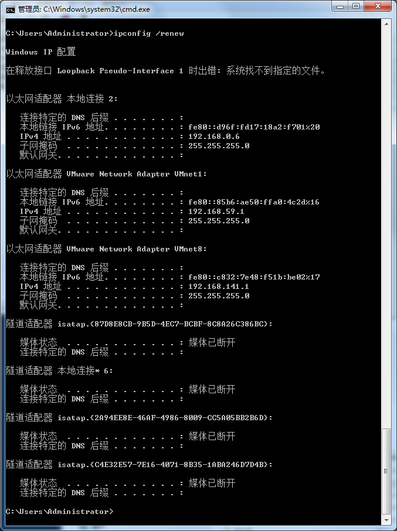

客户机连接并请求了IP地址后，可以在DHCP端查看分配的地址      如下：


### 实验思考

##### 1.存储在DNS数据库中的数据是静态的还是动态的？如何更新？

存储在DNS服务器数据库中的数据是动态的。当客户机的IP地址改变并向DNS服务器请求服务时，DNS服务器的数据库会动态更新记录。此外也可以手动更新DNS服务器中的记录。

##### 2.在创建的DN中添加了正向搜索的主机记录，为什么还要添加反向搜索记录？

因为正向搜索与反向搜索的功能与应用场景不同，正向搜索是可以从主机的域名解析出IP地址，反向搜索时可以从IP地址查询出域名，为了实现所需的功能，就还需要添加反向搜索记录。

##### 3.在上级域名服务器中修改某域名对应的IP地址且配置正确，在客户端测试中发现没有生效，为什么？

首先可以先用`nslookup`命令查看DNS配置是否生效；其次，DNS服务器的数据库中现有的缓存有有效时间，在下级服务器中记录尚未超时时，上级域名服务器的新记录可能不会被下级服务器所更新；最后，DNS域名IP映射的修改广播需要时间，可能需要等待一段时间后再进行测试。

##### 4.实验中只给出了添加主机记录的部分，如果在该域中要添加一个下级子域，如何操作？

右键点击该域，选择新建域，就可以在该域中新建一个下级子域。

##### 5.在Apache Group\Apache\conf\httpd.conf文件中，了解其他选项，比如，如何修改服务器IP地址和端口，默认首页文件名，如何设置虚拟目录等。

修改服务器的IP地址和端口：通过代码`:Listen (ipv4): (port) `可以修改服务器的IP地址和端口，具体例子可以修改文件中的`#Listen 12.34.56.78 : 80`这行代码，将IP与端口号设置为自定义的，并去掉`#`号。

修改默认首页文件名：方法已在实验指导书中给出，直接修改Apache的配置文件./conf/httpd.conf中的`DiretoryIndex test.php`即可改为自己所需的名称，如下图所示：

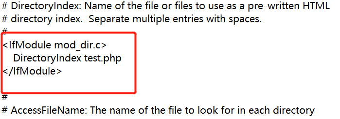

如何设置虚拟目录：在Apache的安装目录下找到conf目录下的httpd.conf文件，搜索DocumentRoot，按照如下方式设置虚拟目录即可：

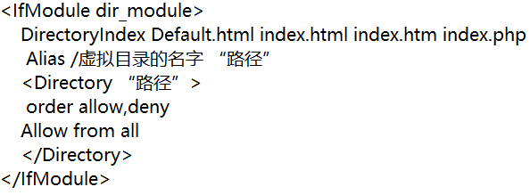

##### 6.比较使用wingdows网络组件IIS开设web服务和Apache开设Web服务各自的优劣。

Apache具有较好的扩展性与稳定性且安全性较好，但在使用以及性能上不如IIS友好，软件的操作需要一定的计算机知识，而且其可以免费使用并且开放源码。

IIS的优势在于其比较容易使用，用户制作发布网站较为便捷，缺点在于IIS只能用于windows环境中，扩展性较差且稳定性不如Apache。

##### 7.论坛实验中，没有涉及后台数据库。如果后台为access数据库，如何使用PHP建立和数据库的连接？

可以使用`odbc_connect`函数，`com`接口，`pdo`三种方式连接access数据库和php。此外，微软的ADOOB数据库进行驱动也能实现目标。示例代码如下：

```php
$conn = new com("ADODB.Connection");
$connstr = “DRIVER = {Microsoft Access Driver (*.mdb)};
DBQ = ”.realpath("test.mdb");
$conn−>Open($connstr);
```

##### 8.了解Php语言的使用以及除论坛外的其他应用。

PHP语言直译即为：超文本预处理器的意思，是在服务器端执行的脚本语言，尤其适用于Web页面开发并可以嵌入到HTML中。PHP语言的语法融合了多种求他语言的特色，并且发展做出了自己的特点。在使用上针对网页及服务器的需求十分有效且灵活。

经过二十多年的发展，PHP已经在越来越广泛包括高性能Web，游戏，实时通讯等众多领域中发挥更重要的作用。

##### 9.DHCP服务器是否可以选择自动获得IP地址？

DHCP是动态协议，可以选择自动获取IP地址。

##### 10.DHCP服务器为何要实现保留IP 地址功能，其在网络地址管理中有什么好处？在作保留IP 地址时，为什么要先记录需保留IP 地址的客户机的网卡的物理地址？

有一些客户机需要使用固定的IP地址，DHCP服务器的保留IP地址功能可以便于满足这些客户机的需求。

保留IP地址的意义就是给固定客户机的IP地址，相当于将网卡的物理地址与固定的IP建立映射关系，所以许愿哦先记录保留IP地址的客户机的网卡的物理地址。

##### 11.客户计算机从DHCP服务器获得租约要经过几个步骤？

四个步骤，分别是：请求IP租约，提供IP租约，选择IP租约和确认IP租约。

##### 12.如果客户机设置了自动获取IP地址，当登录到局域网后，用ipconfig查看IP地址时，显示的IP地址为169.254.16.2，可以判断有什么问题？

如果前的IP地址为`164.254.x.x`则表明该计算机无法正常从DHCP服务器获取IP地址。可能的原因是DNCP服务停止了，或是作用域没有激活，网络连接存在问题等原因。

##### 13.假设为DHCP服务器创建一个名为shixun的作用域，该作用域IP地址的范围是192.168.0.1~192.168.0.254，可否包括192.168.0.0和192.168.0.255这两个地址？

不包括。因为`192.168.0.0`在主机号全为0时，表示的是网络地址，`192.168.255.255`主机号全为1表示的是广播地址，这两种地址不可以作为主机的IP地址。
