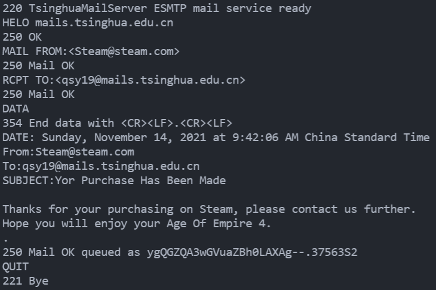
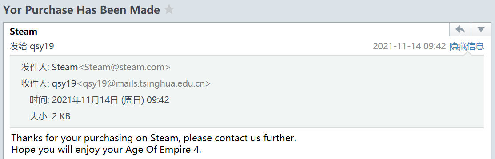
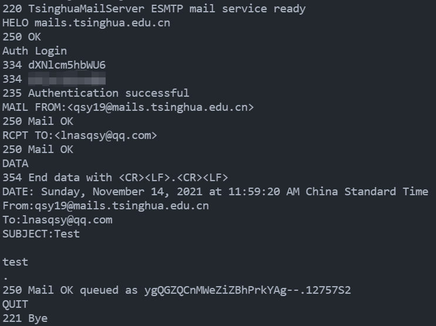
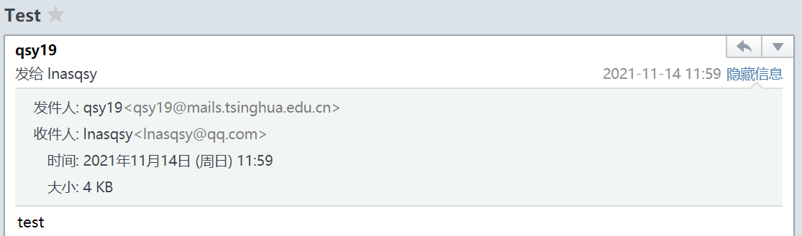
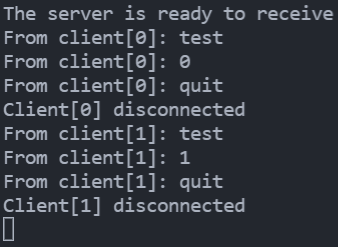
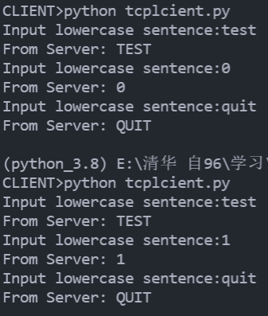
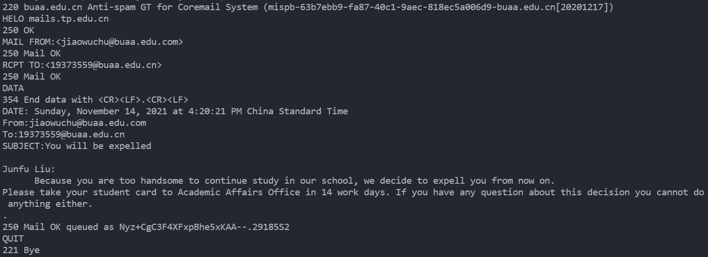

<h2  align = "center" >计算机网络与应用<br>第三次实验报告 </h2>

<h6 align = "center">自96 曲世远 2019011455</h6>


[TOC]

### 实验目的

掌握Socket编程思想，并实现简单的Socket应用的连接通信过程。

### 实验环境

版本：Windows 10 家庭中文版

版本号：20H2

操作系统内部版本：19042.1288

jdk版本：17.0.1

代码编辑器版本：VsCode 1.62.2

### 实验内容

##### 1.不带服务器身份验证的邮件发送客户端实验(Simple SMTP)

按照实验指导书的提示与书中以及课上的内容对于示例代码做微调进行尝试，如附件源代码所示。

主要需要调整的部分即为填入邮箱服务器名称，修改发送接收方地址，填写邮件内容，更改确认代码等。

控制台输出与邮箱收件箱如下图所示：





##### 2.带服务器身份验证的邮件发送客户端实验(Auth SMTP)

相比于上一问，本问完成过程中需要额外向服务器发送`Auth Login\r\n`命令，之后发送账号与密码进行登陆操作。再通过已经验证的身份发送邮件。发送邮件的控制台输出以及邮箱截图如下所示：（为保护个人隐私密码部分已经过处理）





##### 3.自主编写通过socket收发信息的客户端和服务器端程序

基于示例代码编写socket与server通信程序如下文所示，可以实现服务器端的持续接收客户端连接并大小写转换；客户端可以随时与服务器端连接并主动断开。

Server端代码：

```python
while True:
     connectionSocket, addr = serverSocket.accept()
     if connectionSocket != None:
          while True:
               sentence = connectionSocket.recv(1024).decode()
               print('From client[%d]:'%i, sentence)
               capitalizedSentence = sentence.upper()
               connectionSocket.send(capitalizedSentence.encode())
               if sentence == 'quit': 
                    connectionSocket.close()
                    print('Client[%d] disconnected'%i)
                    i += 1
                    break
     connectionSocket.close()
```

Client端代码：

```python
while True:
    sentence = input('Input lowercase sentence:')
    sentence=str.format(sentence, '\r\n')
    clientSocket.send(sentence.encode())
    modifiedSentence = clientSocket.recv(1024)
    print ('From Server:', modifiedSentence.decode())
    if sentence == "quit": 
        clientSocket.close()
        break

```

通信中Server端控制台输出（依次有两个client与之相连接）：



连接中Client端控制台输出（依次启动了两个Client与Server相连接）：



### 实验思考

##### 1.Simple SMTP和常用的E-mail客户端在功能结构上的比较

在功能上：

1. simple SMTP仅能发送邮件，既可以伪装邮件的发送方和接收方有可以通过登录使用认证后的身份发送邮件，但是不可以执行从邮件服务器中的拉取操作，因为SMTP协议是一个推协议。
2. 而E-mail邮件客户端则只能使用登录认证后的身份发送邮件，但是具有更加高级的各种发送功能，也可以实现查看收件箱已发箱等各种高级功能。

在结构上：

1. simple SMTP是面向过程的，不具有用户界面；需要依据协议认真逐项填写。
2. 而E-mail客户端是面向对象的，具有用户界面。同时也可以比较容易使用的填写各项所需内容。

##### 2. 使用TCP和UDP各自的优缺点比较。

TCP通过三次握手建立连接，是面向连接的协议。TCP的特点与优势在于其存在拥塞控制与流量控制，具有可靠保序的字节流传输能力。其缺点在于其为了确保提供可靠传输服务会占用一定的系统资源。

而UDP是一个无连接不可靠的传输服务协议，UDP优点在于其延迟较低，被广泛应用在可以允许丢包的场景下使用（如流媒体等场合）。其缺点在于由于没有流量控制与拥塞控制，会存在网络堵塞时无法缓解的情况。由于其不可靠传输服务的特点，还会存在丢失乱码等现象。

##### 3.针对程序中出现的问题及解决方法，写出实验体会。

本次实验中，我出现了以下问题：

1. 由于本机的JDK版本过高，与实例代码中提供的`sun.misc`包不兼容，无法使用`BASE64Encoder`。再上网查阅资料后我将这一部分替换为了`Base64.Encoder`很好的实现了原有功能。

2. 在进行前两个实验时，偶尔会遇到450，550等报错，会提示Invalid IP等错误。经过我的分析与实验后认为主要是由于SMTP服务器会对比较接近的域名进行验证，如果对`mails.tsinghua.edu.cn`服务器使用`@mails.tsinghua.edu.cn`后缀邮箱发送邮件，其就会要求你验证身份或是拒绝发送。对于其他邮件服务器同理，解决这一问题主要可以通过替换邮箱后缀名的方式解决。我在解决了这一问题后还尝试利用了其他的邮件服务器发送邮件给同学，也成功地完成了发送（已和同学申明发送人与内容）：

   

